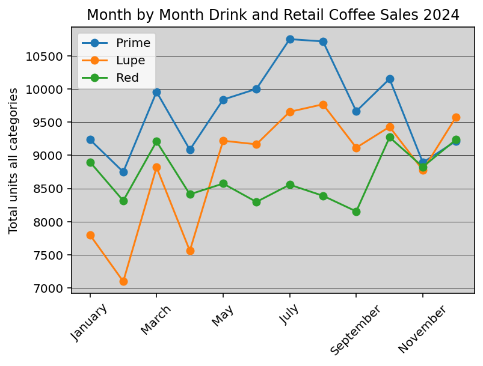
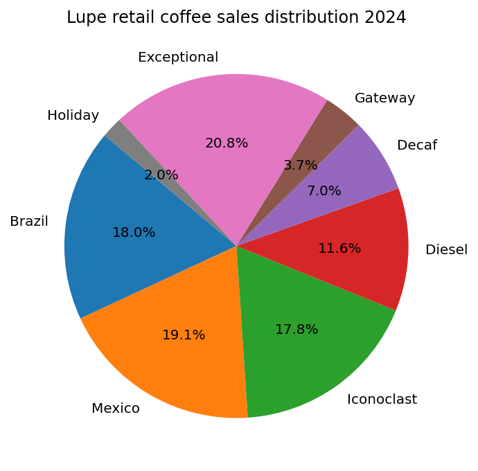
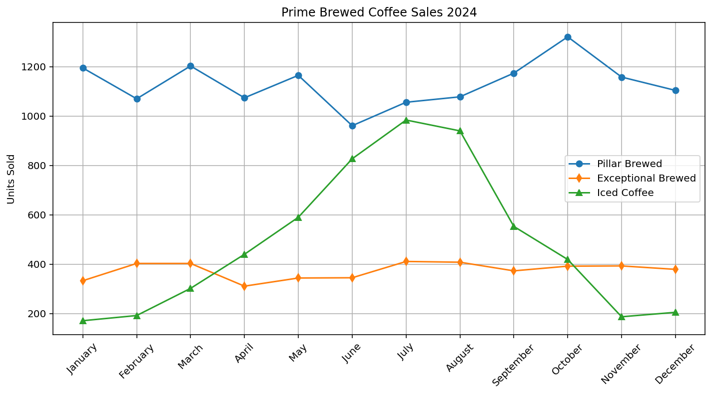

# Iconik_2024_production

This collection of graphs and charts visualizes Iconik Coffee Roaster's 2024 beverage and retail coffee sales across its three cafes. The data itself is proprietary and not included in the repo, but the code contains a variety of useful matplotlib and pandas tools for producing simple line graphs and pie charts. More images are included but here are a few samples:

# [Code for Month by Month Drink and Retail Coffee Sales](cafe_pars.py) ⬆️

# [Retail Coffee Sales Distribution Code](retail_coffee_sales_distributions.py) ⬆️

# [Brewed Coffee Sales Code](cafe_totals.png)
